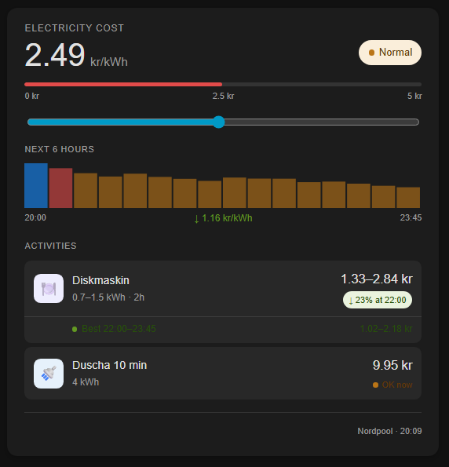

# electricity-cost-card

A Home Assistant custom card that displays real-time electricity pricing from Nordpool with per-activity cost calculations, a price graph for upcoming hours, and smart recommendations for when to run your appliances.



## Features

- **Live price** from Nordpool sensor (15-minute blocks)
- **Price graph** covering the next N hours, configurable per dashboard
- **Per-activity cost** — each appliance shows what it will cost right now
- **Duration mode** — appliances with a set runtime show the integrated cost over real upcoming price blocks, not just the current spot price
- **Best window** — finds the cheapest consecutive time slot within your search horizon
- **Simulation slider** — drag to simulate any price and see how costs change; resets to live with one tap
- **Visual editor** — configure all settings directly in the HA dashboard UI, with a generated YAML snippet you can copy
- **Threshold-based recommendations** — Good / OK / Wait per appliance, based on price per kWh vs your own threshold


## Requirements

- Home Assistant with a working [Nordpool integration](https://github.com/custom-components/nordpool) (HACS)
- The Nordpool sensor must expose:
  - `state` — current price in kr/kWh
  - `attributes.today` — list of 96 price values (one per 15-minute block)


## Installation

### 1. Via HACS (recommended)

Installation is easiest via the [Home Assistant Community Store (HACS)](https://hacs.xyz/), which is the best place to get third-party integrations for Home Assistant. Once you have HACS set up, simply click the button below (requires My Home Assistant configured) or follow the [instructions for adding a custom repository](https://hacs.xyz/docs/faq/custom_repositories) and then locate **Electricity Cost Card** under **Frontend** and install it.

[](https://my.home-assistant.io/redirect/hacs_repository/?owner=johro897&repository=electricity-cost-card&category=dashboard)

### 2. Manual install

1. Copy `electricity-cost-card.js` to `/config/www/electricity-cost-card/electricity-cost-card.js`

2. Add the resource through **Settings → Dashboards → Resources → +**:
   ```yaml
   url: /local/electricity-cost-card/electricity-cost-card.js
   type: module
   ```

3. Reload the browser cache (`Ctrl/Cmd + Shift + R`)


## Configuration

Add the card to any dashboard via the UI card picker, or paste the YAML manually.

### Minimal example

```yaml
type: custom:electricity-cost-card
entity: sensor.nordpool_kwh_se3_sek_3_10_025
activities:
  - name: Dishwasher
    icon: "🍽️"
    kwh_min: 0.7
    kwh_max: 1.5
    threshold: 1.2
```

### Full example

```yaml
type: custom:electricity-cost-card
entity: sensor.nordpool_kwh_se3_sek_3_10_025
hours_ahead: 6
search_hours: 12
activities:
  - name: Dishwasher
    icon: "🍽️"
    kwh_min: 0.7
    kwh_max: 1.5
    threshold: 1.2
    duration_hours: 2.0
  - name: Wash & tumble
    icon: "👕"
    kwh_min: 2.0
    kwh_max: 4.0
    threshold: 1.0
    duration_hours: 3.0
  - name: Charge EV
    icon: "🔋"
    kwh_min: 40
    kwh_max: 100
    threshold: 0.8
    duration_hours: 4.0
  - name: 10-min shower
    icon: "🚿"
    kwh_min: 4.0
    kwh_max: 4.0
    threshold: 1.5
```

### Root options

| Key | Type | Default | Description |
|---|---|---|---|
| `entity` | string | **required** | Nordpool sensor entity ID |
| `hours_ahead` | integer | `6` | How many hours the price graph covers |
| `search_hours` | integer | `12` | How far ahead to search for the best activity window |
| `activities` | list | `[]` | List of activity definitions (see below) |

### Activity options

| Key | Type | Required | Description |
|---|---|---|---|
| `name` | string | ✓ | Display name |
| `icon` | emoji | ✓ | Icon shown on the card |
| `kwh_min` | number | ✓ | Minimum energy consumption in kWh |
| `kwh_max` | number | ✓ | Maximum energy consumption in kWh |
| `threshold` | number | ✓ | Price per kWh below which the activity is considered "good" |
| `duration_hours` | number | — | Runtime in hours. Enables integrated cost calculation and best-window search |


## How recommendations work

Recommendations compare the **current price per kWh** against the activity's `threshold`:

| Condition | Badge |
|---|---|
| `price ≤ threshold` | 🟢 Good now |
| `price ≤ threshold × 2` | 🟡 OK now |
| `price > threshold × 2` | 🔴 Wait |

For activities with `duration_hours`, the price used is the **average price over the full runtime** starting now — not just the spot price at this moment.

### Suggested threshold values (Swedish market)

| Appliance | Suggested threshold |
|---|---|
| EV charging (patient load) | `0.5` – `0.8` |
| Washing machine + tumble dryer | `0.8` – `1.0` |
| Dishwasher | `1.0` – `1.2` |
| Shower (hard to defer) | `1.5` – `2.0` |


## How duration cost is calculated

When `duration_hours` is set, the card looks up the actual 15-minute price blocks from Nordpool and calculates:

```
cost = average_price_over_window × kwh
```

**Cost if started now** — sums the real upcoming blocks covering the full runtime.

**Best window** — slides a window of the same length across the next `search_hours` and finds the slot with the lowest average price. The saving percentage is shown if it exceeds 3%.


## Visual editor

The card includes a built-in visual editor accessible from the HA dashboard UI. It allows you to:

- Set the entity and graph/search hours
- Add, edit, and remove activities with all fields
- Copy the generated YAML at any time

The editor does not save to a file — it updates the card config in your dashboard's YAML, which is backed up with Home Assistant as usual.

## Storage and backup

All configuration lives in the dashboard YAML (`ui-lovelace.yaml` or the `.storage/lovelace.*` files depending on your setup). It is included in Home Assistant backups automatically and shared across all devices and browsers that access your HA instance.


## License

MIT © 2026
